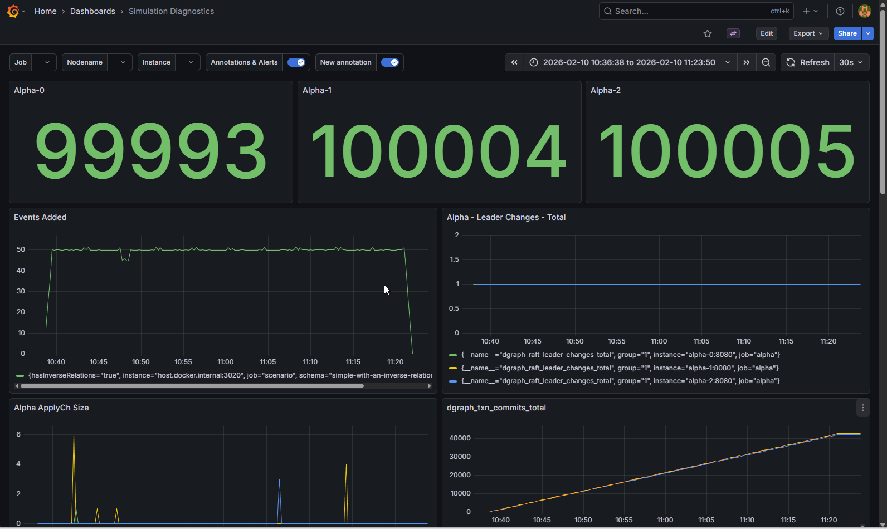

# Dgraph Load Test

A small load-test harness to reproduce data consistency issues. It writes sequential events (0..MAX_EVENTS) across multiple Dgraph alpha endpoints, then validates for gaps/duplicates.

## Requirements

- Go 1.25+
- Dgraph running locally with GraphQL enabled
- Alpha endpoints reachable at:
  - http://localhost:8080
  - http://localhost:8081
  - http://localhost:8082

If you use different endpoints, update the `servers` list in `main.go`.

## Files

- `main.go` - load test runner
- `schema.sdl` - GraphQL schema uploaded when missing or incompatible
- `docker-compose.yml` - optional local stack

## Run

1) Start your Dgraph stack (or `docker-compose up` if you use the included compose file).
1a) It's recommended to run a [prometheus node exporter](https://github.com/prometheus/node_exporter) on `:9100` to grab the host resources.
2) Run the load test:

```
go run .
```

The script will:

- Upload `schema.sdl` if the schema is missing or incompatible.
- Drop existing data.
- Seed people nodes (E.g. Alice, Bob, Charlie, David, Eve).
- Insert events with sequential `value` fields (0..MAX_EVENTS).
- Validate each alpha for gaps or duplicates.

## Metrics

A small Prometheus-style endpoint is exposed at:

- http://localhost:3020

## Logs

Per-worker error logs are written to:

- `error-<worker-id>.log`

## Configuration

Adjust these constants in `main.go` as needed:

- `WORKERS`
- `WORKER_LOOP_INTERVAL`
- `MAX_EVENTS`
- `VALIDATION_INTERVAL`
- `VALIDATION_POLL`

## Expected Behavior

- The test stops after inserting event values up to `MAX_EVENTS` (inclusive).
- Validation reports missing or duplicate values, including the insert timestamp when available.

## Grafana Dashboard



A grafana dashboard is also provided in the `docker-compose.yml`, it should automatically start and provision datasources and a dashboard. Use [http://localhost:3000](http://localhost:3000) to access. Default login is admin/admin.

## Troubleshooting

- If the app cannot reach Dgraph, it will panic (expected behavior for this repro).
- If schema upload fails, check that the admin endpoint is reachable at http://localhost:8080/admin/schema.
